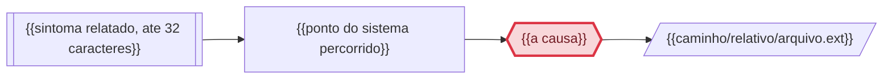

> `regressao_de` so e preenchido com EVIDENCIA de que o codigo causador deste problema foi introduzido ou alterado por aquele trabalho. Coincidencia de arquivo NAO e regressao: sem vinculo causal comprovado, `regressao_de: null` e `evidencia_regressao: null`, e a suspeita vai na prosa (regra 15). Preenchido um, preenchido o outro.

> Frontmatter obrigatorio (expx-schema v1). Formato completo em `references/00-schema.md`. Substitua os marcadores; NUNCA omita uma chave — ausente e `null`, lista vazia e `[]`. Sem acento em chave nem em valor de enum. `atualizado_em` e reescrito a cada gravacao.

## Cadeia da causa

> SUBSTITUA o bloco abaixo pela cadeia desta ocorrencia, gerada no E1.b pelas regras de `references/07-diagrama.md`. Do sintoma relatado ate a causa: `S1` o sintoma, `P1..Pn` os pontos percorridos na investigacao, `C1` a causa em destaque, `A1..An` os arquivos impactados como folhas. Identificador sem acento; o rotulo entre aspas pode ter acento.
>
> `R1` so existe quando `regressao_de` esta preenchido: `R1 -.->|"introduziu"| C1`. Coincidencia de arquivo nao e regressao (regra 15) e nao vira no.
>
> Causa NAO comprovada (`STATUS: NAO COMPROVADO`): `C1` leva `?` no rotulo, a classe `suposta` no lugar de `causa`, e a seta que chega nele e tracejada. Hipotese nunca aparece com forma de fato.
>
> Acima de 12 nos: os pontos intermediarios `P1..Pn` colapsam em um no `P0["N pontos percorridos"]` — sintoma, causa, arquivos e trabalho anterior nunca sao resumidos.
>
> Derivacao, nunca invencao: so entra no diagrama o que esta escrito neste arquivo. Diagrama e derivado e nunca bloqueia o estagio.



# Causa raiz — {{OC-ID}} {{título da ocorrência}}

> Usado quando `tipo: bug`. Obrigatório PROVAR a causa, não supor. Hipótese sem prova não passa do E1.

STATUS: {{COMPROVADO | NÃO COMPROVADO}}

## Comportamento atual

{{O que o sistema faz hoje, com evidência: caminho/arquivo.ext:linha.}}

## Comportamento esperado

{{O que deveria acontecer, e por quê — regra de negócio ou contrato que sustenta essa expectativa.}}

## A prova

{{Pelo menos uma das três formas abaixo. Apague as que não usar.}}

**Teste que reproduz e falha:**
```
{{o teste e a saída vermelha, colada}}
```

**Log, stack trace ou query que evidencia o caminho do erro:**
```
{{colado literalmente, não parafraseado}}
```

**Trecho de código identificado:**
```
{{trecho}}
```
`{{caminho/relativo/arquivo.ext}}:{{linha}}` — {{o mecanismo: qual entrada leva a qual desvio, e por que produz a saída errada}}

{{Se STATUS = NÃO COMPROVADO: escreva aqui a hipótese mais forte e, abaixo, exatamente o que falta para comprovar — acesso, log, ambiente, dado de produção. O E2 fica bloqueado enquanto este marcador existir.}}

## Regressão

> Preencha depois de estabelecida a causa, consultando o histórico dos arquivos impactados — pelo `memox` quando instalado, pelo versionador (`git log -L`, `git blame`) quando não.

{{Uma das três formas, apague as outras duas:}}

**É regressão:** o trecho responsável foi introduzido/alterado por `{{trabalho_id}}`. {{Qual trecho, em qual arquivo, e o que naquele trabalho o alterou — a mesma linha que vai em `evidencia_regressao`.}}

**Não é regressão:** {{o que o histórico mostrou e por que não fecha como vínculo causal. Se outro trabalho tocou o mesmo arquivo sem relação com este trecho, registre a suspeita AQUI — coincidência de arquivo não é regressão, e o campo `regressao_de` fica `null`.}}

**Histórico indisponível:** {{nem `memox` nem versionador com histórico; a limitação está registrada em `base/00-LACUNAS.md`. Campos como `null`.}}

## Arquivos e módulos impactados

> Esta lista TRAVA o escopo: o que não está aqui não é tocado no E3.

- `{{caminho/relativo/arquivo.ext}}` — {{o que muda nele}}
- `{{caminho/relativo/arquivo.ext}}` — {{o que muda nele}}

## Opções de solução consideradas

| Opção | Trade-off |
|---|---|
| {{opção}} | {{o que ganha, o que perde}} |
| {{opção}} | {{o que ganha, o que perde}} |

## Decisões

> Formato fixo. Não apague decisões: uma decisão revertida ganha nova linha que cita a anterior.

```
D-01 | {{decisão tomada}} | {{alternativa descartada}} | {{motivo}}
```

## Como isso será testado

{{Estratégia de teste que o E2 vai converter em tasks: o teste de regressão que reproduz o problema, e o que os testes de integração e funcional de cada task precisam cobrir.}}
