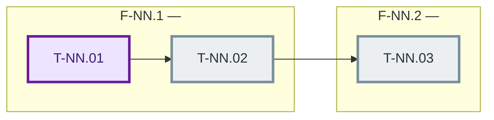
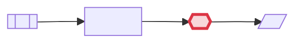
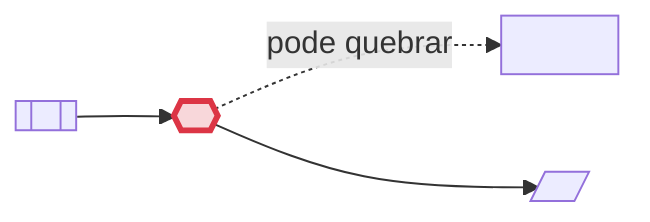
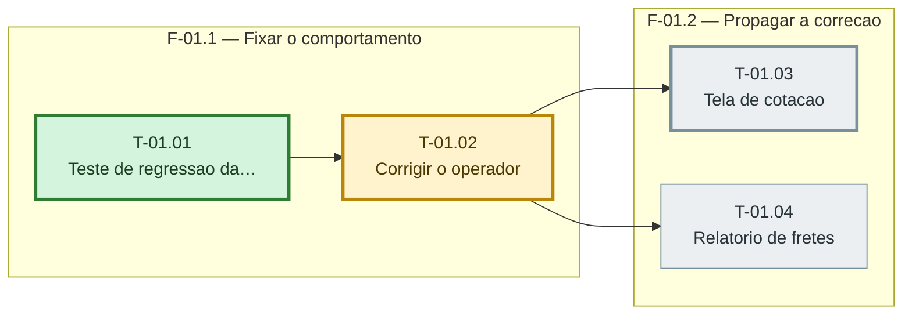
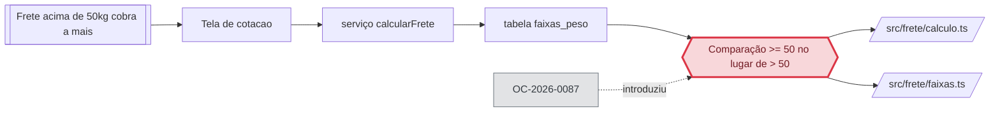

# Diagramas Mermaid — grafo de tasks e cadeia da causa

Leitura necessária no estágio que for gerar ou atualizar um diagrama: **E1.b** (cadeia da causa), **E2** (grafo de tasks) e **E3** (atualização de cor por task).

O plano já declara paralelismo e dependência — nos campos `depende_de` e `paralelizavel` — mas os declara em texto, e ninguém enxerga um grafo lendo uma lista. VS Code e GitHub renderizam Mermaid dentro de Markdown nativamente: um bloco no próprio arquivo do plano transforma esse texto em imagem, sem extensão, sem servidor, sem infraestrutura.

No runx há um ganho extra: **quem revisa o pull request e quem faz o QA não participaram do planejamento**. Um diagrama do que mudou e em que ordem é a forma mais rápida de dar contexto a essas pessoas.

## O que o diagrama é, e o que ele não é

O diagrama é **derivado**. Ele não decide nada, não trava nada e não é regra inviolável.

- Ele é gerado exclusivamente a partir do que já está escrito nos campos das tasks e do `01-CAUSA-RAIZ.md`. Nada entra no diagrama que não esteja no arquivo.
- Falha ao gerar ou ao atualizar um diagrama é **registrada e ignorada**: o trabalho segue. Nenhum portão de estágio, nenhum critério de saída e nenhum veredito depende de um bloco Mermaid existir ou estar correto.
- Quando o disco e o diagrama divergirem, **o disco vence** — o diagrama é regerado a partir dele, nunca o contrário.

A única coisa que o diagrama **não** faz é inventar. Ver "Derivação, nunca invenção", abaixo.

---

## Regras de geração — valem para os dois diagramas

### 1. Derivação exclusiva dos campos existentes

Só entra no diagrama o que está escrito no arquivo de origem:

| Diagrama | Origem | Campos |
|---|---|---|
| Grafo de tasks | `sprint-NN/tasks.md` + `sprint-NN/fases.md` | `id`, `titulo`, `fase`, `status`, `depende_de`, `paralelizavel`, `teste_regressao` |
| Cadeia da causa | `01-CAUSA-RAIZ.md` | `STATUS`, comportamento atual, a prova, `arquivos_impactados`, `regressao_de`, `modo` |

Nó sem origem em campo é proibido. Não acrescente uma etapa intermediária "que faz sentido", não desenhe um chamador que a investigação não listou, não infira uma dependência que o `depende_de` não declara.

### 2. Contradição entre campos não gera diagrama — gera erro de plano reportado

Se os campos se contradizem, **não desenhe nada** para o trecho contraditório e **reporte a contradição ao usuário**. Um diagrama que "resolve" a contradição escolhendo um dos lados esconde um defeito de plano; reportá-la é um achado valioso, e barato, porque é encontrado antes do E3 gastar uma rodada.

Contradições que a geração detecta:

| Contradição | Como se manifesta |
|---|---|
| `paralelizavel: true` com `depende_de` não vazio | A task não pode ser paralela e ao mesmo tempo esperar outra |
| `depende_de` aponta para id que não existe | Seta sem destino |
| Ciclo de dependência (A → B → A) | Grafo não é DAG; não há ordem de execução |
| Task com `fase` que não existe em `fases.md` | Nó sem agrupamento |
| Duas tasks com o mesmo `id` | Nó ambíguo |

Ao detectar qualquer uma: **pule a geração do bloco**, deixe no lugar do bloco a linha

```
> Diagrama não gerado: contradição no plano. <a contradição, em uma linha>
```

e anuncie ao usuário, na conversa, a contradição e a task envolvida. No E2, corrija o plano e regere — o E2 é o lugar de mexer no plano. Registre no rastro:

```bash
python3 .claude/runx-hooks/comum/rastro.py --evento diagrama_nao_gerado --fase <e1|e2|e3> \
  --resultado contradicao --detalhe "<a contradição, uma linha>"
```

### 3. Identificadores sem acento; o texto visível pode ter

O identificador do nó casa com `[A-Za-z_][A-Za-z0-9_]*`: **sem acento, sem ponto, sem hífen, sem espaço.** O rótulo — o que aparece na tela, entre aspas — pode ter acento, e deve, porque é português.

Derive o identificador do `id` trocando `-` e `.` por `_`:

```
T-01.02  →  T_01_02
F-02.1   →  fase_02_1
```

O identificador do subgraph começa por `fase_` e por isso nunca colide com o de uma task. Para os nós da cadeia da causa, use prefixo + número: `S1` (sintoma), `P1`..`Pn` (pontos percorridos), `C1` (causa), `A1`..`An` (arquivos), `R1` (trabalho anterior).

Mermaid até tolera `T-01.01` como identificador nu, mas o ponto e o hífen são ambíguos junto de outros construtores e quebram em versões diferentes do renderizador. **Use sempre a forma sanitizada.**

### 4. Título no nó, cortado e curto

O rótulo é sempre `"<id da task><br/><título cortado>"`. O `id` mantém a grafia original, com hífen e ponto — ele está dentro das aspas, é texto visível.

O título é **cortado em 28 caracteres**, no espaço anterior ao limite, com reticências quando cortado: `"Criar client HTTP autenticado do fornecedor"` vira `"Criar client HTTP…"`. Título comprido estica o nó, e nó largo transforma o grafo numa escada ilegível. Nada de objetivo, critério de aceite ou lista de arquivos dentro do nó — quem quer isso lê o `tasks.md`, que está ao lado.

**Todo rótulo vai entre aspas duplas**, sempre. É a regra que evita o problema de parse mais comum: um `(`, `>`, `:` ou `#` no título quebra o bloco inteiro quando o rótulo está nu.

**Caracteres que quebram o parse, e o que fazer:** aspas duplas (`"`) viram aspas simples; colchetes (`[` `]`), chaves (`{` `}`) e parênteses (`(` `)`) são removidos; `|`, `<` e `>` são removidos; `#` e `&` são removidos. Acento no texto visível pode ficar. Se depois da limpeza o título ficar vazio, use só o `id`.

### 5. Orientação da esquerda para a direita

`flowchart LR`, nos dois diagramas, sempre. Dependência e causalidade lêem-se da esquerda para a direita, e a tela é mais larga que alta.

### 6. Sem estilo além do necessário

O estilo existe para três coisas, e só para elas: **status**, **causa** e **caminho crítico**. Nada de tema, ícone, fonte, largura de nó ou cor decorativa.

Paleta fixa, **idêntica à da `sprintx`** — não invente cor nova, não troque a de um status:

```
classDef concluida fill:#d4f4dd,stroke:#2e7d32,color:#1b3d20
classDef andamento fill:#fff3cd,stroke:#b8860b,color:#4a3800
classDef bloqueada fill:#f8d7da,stroke:#c62828,color:#4a1d1f
classDef pendente  fill:#eceff1,stroke:#78909c,color:#263238
classDef critico   stroke-width:3px
```

No grafo de tasks, **declare as cinco sempre**, mesmo que uma delas não seja usada naquela sprint: assim o bloco é o mesmo em todas as sprints, e o E3 só precisa trocar a palavra numa linha `class`.

Mais três classes existem só na runx, porque representam coisas que a `sprintx` não tem — a task do teste de regressão e a cadeia da causa. Declare-as apenas onde forem usadas:

```
classDef regressao fill:#ede4ff,stroke:#6a1b9a,color:#3d1a78,stroke-width:3px
classDef causa     fill:#f8d7da,stroke:#c62828,color:#4a1d1f,stroke-width:3px
classDef suposta   fill:#fff3cd,stroke:#b8860b,color:#4a3800,stroke-dasharray:4 3
classDef anterior  fill:#eceff1,stroke:#78909c,color:#263238
```

### 7. Limite de tamanho — regra dura

**Nunca gere diagrama que não caiba numa tela.**

- **Grafo de tasks, acima de 25 tasks na sprint:** **uma visão geral das fases** primeiro (um nó por fase, com aresta de `F-A` para `F-B` quando alguma task de `F-B` depende de alguma task de `F-A`), e em seguida **um diagrama por fase**, cada um sob o título da sua fase. O detalhe está na seção "Acima de 25 tasks" do Diagrama 1.
- **Cadeia da causa, acima de 12 nós:** resuma os **pontos intermediários** — o sintoma, a causa, os arquivos impactados e o trabalho anterior nunca são resumidos; os `P1..Pn` do meio do caminho colapsam em um nó `P0["N pontos percorridos"]`, com a lista completa continuando na prosa do arquivo, que é onde ela já está.

A contagem é de nós, não de linhas do bloco.

### 8. Sintaxe: o que quebra o parse

Verificado contra o parser do Mermaid 11:

| Quebra | Correto |
|---|---|
| `T_01_01[Corrige calculo (faixa > 50kg)]` | `T_01_01["T-01.01<br/>Corrige calculo faixa 50kg"]` — aspas, e `(` `)` `>` removidos |
| Rótulo com aspa dupla dentro das aspas | Troque por aspa simples |
| Identificador com acento, ponto, hífen ou espaço | `[A-Za-z_][A-Za-z0-9_]*`; `T-01.01` → `T_01_01` |
| `end` como identificador ou início de rótulo nu | Palavra reservada de `subgraph`; entre aspas resolve |
| Marcador `{{...}}` em posição de identificador | `{{` é a sintaxe de nó hexagonal; marcador só DENTRO de rótulo entre aspas |
| Título de `subgraph` sem aspas | `subgraph fase_01_1["F-01.1 — titulo"]` |

**Cuidado com as chaves duplas.** `{{ }}` é ao mesmo tempo o marcador de preenchimento dos templates desta skill e a sintaxe de nó hexagonal do Mermaid. Dentro de um rótulo entre aspas — `C1{{"{{a causa}}"}}` — as duas convivem. Em posição de identificador — `T{{NN}}_01` — o parser quebra o bloco inteiro. Nos blocos de exemplo dos templates, o identificador vem sempre concreto (`T_01_01`), e só o rótulo leva marcador.

**Nada de `linkStyle`.** A `sprintx` o proíbe e a runx o proíbe junto: o caminho crítico é marcado pela classe `critico`, não por índice de seta. Índice de `linkStyle` é contado na ordem de declaração das setas e, quando aponta para uma seta que não existe, **o bloco inteiro falha a renderizar** — um erro invisível na leitura do texto, que some quando o destaque vive numa classe.

---

## DIAGRAMA 1 — Grafo de tasks

**Onde:** dentro de `docs/manutencao/<OC-ID>-<slug>/sprint-NN/fases.md`, **abaixo do frontmatter e antes da prosa**. Um bloco por sprint (ou um por fase, acima de 25 tasks).

**Quando:** gerado no E2, ao escrever o plano. Atualizado no E3, a cada task fechada — só a cor daquele nó.

### O que mostra

- **Cada task como nó**, com id e título curto.
- **Dependências como setas**, derivadas de `depende_de`: para cada `X` em `depende_de` da task `Y`, uma seta `X --> Y`. Sempre `-->`, nunca `-.->`, `==>` nem `---`, e sem rótulo de aresta.
- **As arestas ficam FORA dos subgraphs**, todas juntas, depois do último `end`. Aresta dentro de subgraph faz o Mermaid puxar o nó de destino para o grupo errado.
- **Fases como agrupamento** — um `subgraph` por fase, na ordem em que as fases aparecem no frontmatter. Task sem `fase` declarada fica fora de qualquer subgraph; não invente uma fase para ela.
- **Caminho crítico em destaque** — classe `critico`, que só engrossa a borda.
- **Status por cor**, pela paleta da regra 6, **uma linha `class` por task**, um nó por linha, na ordem dos ids. É isso que torna a atualização do E3 uma troca de palavra numa linha, em vez de uma reescrita do bloco.
- **A task do teste de regressão marcada de forma distinta** — classe `regressao`, borda grossa e roxa. Ela é a primeira e é a que prova que o problema foi entendido: merece destaque próprio, não ser mais um nó igual aos outros. É a task que carrega `teste_regressao` não nulo. A marcação **substitui** a cor de status enquanto a task não estiver concluída; concluída, ela recebe `concluida` como qualquer outra, e o destaque passa a ser desnecessário porque a prova já foi dada.

**Paralelismo é ausência de aresta, nunca uma aresta.** `paralelizavel` não gera traço nenhum: duas tasks sem caminho entre si aparecem lado a lado, e é assim que o paralelismo se vê.

### Como derivar o caminho crítico

O caminho crítico é a **cadeia mais longa de tasks sequenciais** da sprint — a maior quantidade de tasks que precisam acontecer uma depois da outra. É ela que limita o calendário: por mais gente que se ponha na ocorrência, ela não termina antes dessa cadeia.

Como derivar, contando tasks (não esforço — o runx não estima duração em lugar nenhum):

1. Para cada task sem dependência, o comprimento é 1.
2. Para as demais, o comprimento é 1 + o maior comprimento entre as tasks de `depende_de`.
3. O caminho crítico é a cadeia que termina no maior comprimento, refeita para trás pelo antecessor que deu o máximo.
4. **Empate: escolha a cadeia cujo último id é menor** (ordem alfabética do `id`) — o mesmo critério da `sprintx`. Se ainda houver empate porque as cadeias terminam na mesma task, compare-as **elemento a elemento, do começo ao fim**, e fique com a primeira na ordem alfabética. Um critério qualquer, desde que determinístico — o mesmo plano tem que gerar sempre o mesmo diagrama.

O segundo desempate não é um detalhe raro: um grafo em losango (uma task que abre em três caminhos paralelos e volta a fechar numa só) produz cadeias de mesmo comprimento **e** de mesmo último id, e sem ele duas execuções sobre o mesmo plano marcariam caminhos críticos diferentes.

Marque a cadeia com uma linha `class` única, listando os nós separados por vírgula, com a classe `critico`. Ela **soma** ao status em vez de substituí-lo, então um nó do caminho crítico continua mostrando a própria cor — por isso a linha do `critico` vem **depois** de todas as linhas de status.

Quando toda a sprint for uma cadeia única, o caminho crítico é a sprint inteira — marque mesmo assim; a informação "não há nada em paralelo aqui" é útil.

### Formato exato

````markdown

````

Ordem obrigatória dentro do bloco, fixa: comentário `%%` → `flowchart LR` → `subgraph` das fases com os nós → arestas → `classDef` → `class` de status, uma por task → `class` do `critico`, por último. Nada além disso.

### Acima de 25 tasks

Com 26 tasks ou mais numa sprint, no lugar do diagrama único gere:

1. **Um diagrama de visão geral**, primeiro, só com as fases como nós. Existe aresta de `F-A` para `F-B` quando alguma task de `F-B` depende de alguma task de `F-A` — sem repetir a aresta, e sem auto-aresta quando as duas tasks são da mesma fase. O nó da fase mostra a quantidade de tasks, no formato `"F-NN.M<br/>título da fase — 8 tasks"`, **sem parênteses**, que estão na lista de caracteres removidos do rótulo. O caminho crítico entre fases usa a mesma classe `critico`, calculado sobre o grafo de fases: o comprimento de cada fase é 1, e a cadeia mais longa é a de fases encadeadas, com o mesmo desempate por menor `id`.
2. **Um diagrama por fase**, na sequência, cada um com as tasks daquela fase, sem `subgraph` (o título da seção já diz de que fase é), com as arestas internas da fase.

Cada diagrama vai precedido de um título de nível 3 (`### Visão geral das fases`, `### F-NN.M — título da fase`), e todos ficam na mesma posição: abaixo do frontmatter, acima da prosa das fases.

Dependência que atravessa fases não aparece no diagrama por fase — ela está no de visão geral. Não desenhe nó fantasma de outra fase.

Se uma fase sozinha passar de 25 tasks, a fase está grande demais — registre isso junto com o diagrama, como observação de plano, e gere o diagrama dela mesmo assim: o limite existe para a sprint, e não há subdivisão abaixo de fase para onde quebrar.

---

## DIAGRAMA 2 — Cadeia da causa

**Onde:** dentro de `docs/manutencao/<OC-ID>-<slug>/01-CAUSA-RAIZ.md`, **abaixo do frontmatter e antes da prosa**.

**Quando:** gerado no E1.b, ao fechar a investigação.

Este é o diagrama de maior valor para quem revisa: ele conta, em uma imagem, o caminho do sintoma relatado até a causa provada, e quais arquivos isso alcança.

O conteúdo muda com o `modo` do frontmatter.

### Modo `causa_raiz` (`tipo: bug`)

Mostra o caminho do sintoma até a causa:

- **O sintoma relatado pelo cliente** — do `00-OCORRENCIA.md`, cortado em 28 caracteres pela regra 4. Nó `S1`, forma `[["..."]]`.
- **Os pontos do sistema percorridos na investigação** — `P1..Pn`, na ordem em que a investigação os percorreu, cada um com o nome do componente/função, não o caminho completo do arquivo. Forma padrão `["..."]`.
- **A causa raiz, em destaque** — nó `C1`, forma `{{"..."}}`, classe `causa`.
- **Os arquivos impactados como folhas** — um nó `A1..An` por caminho de `arquivos_impactados`, forma `[/"..."/]`, saindo de `C1`.
- **O trabalho anterior, quando houver `regressao_de` preenchido** — nó `R1`, classe `anterior`, ligado por seta para a causa: `R1 -.-> C1`, com o rótulo de seta `introduziu`. O nó traz o `trabalho_id`. **Só desenhe `R1` quando `regressao_de` não for `null`** — a regra 15 do SKILL.md vale aqui inteira: coincidência de arquivo não é regressão, e suspeita descartada mora na prosa, nunca no diagrama.

### Causa não comprovada

Quando `01-CAUSA-RAIZ.md` traz `STATUS: NÃO COMPROVADO` (e `comprovada: false`), **o nó da causa aparece marcado como não comprovado, e não como fato**:

- rótulo prefixado com `?`: `C1{{"? <hipotese> (NAO COMPROVADO)"}}`;
- classe `suposta` — amarelo tracejado — em vez de `causa`;
- a seta que chega em `C1` é tracejada (`-.->`), não sólida.

Nunca desenhe uma hipótese com a forma de um fato. O diagrama é lido por quem não leu o arquivo; um nó vermelho sólido escrito "causa raiz" afirma algo que a investigação explicitamente não afirmou.

### Modo `analise_impacto` (`tipo` ≠ `bug`)

O diagrama muda de conteúdo — não há defeito a explicar, há mudança a dimensionar. Não existe nó de causa; existe nó do que muda.

- **O comportamento atual** — nó `H1`, forma `[["..."]]`, derivado de "Como o sistema se comporta hoje".
- **O que muda** — nó `M1`, forma `{{"..."}}`, classe `causa` (é o centro do diagrama, o equivalente estrutural da causa), derivado de "O que exatamente muda".
- **O que pode quebrar junto** — um nó `Q1..Qn` por linha da tabela "O que pode quebrar junto": os chamadores, telas, relatórios, integrações, migrações e cache. Saem de `M1` por seta tracejada `-.->` com rótulo `pode quebrar`.
- **Os arquivos impactados como folhas** — `A1..An`, como no outro modo, saindo de `M1`.
- **`R1` quando houver `regressao_de`**, exatamente como no outro modo.

### Formato exato — modo `causa_raiz`

````markdown

````

### Formato exato — modo `analise_impacto`

````markdown

````

---

## Atualização

| Momento | O que acontece |
|---|---|
| E2, ao gerar o plano | Cria o grafo de tasks em `fases.md` |
| E1.b, ao concluir a investigação | Cria a cadeia da causa em `01-CAUSA-RAIZ.md` |
| E3, ao fechar cada task | Atualiza **a cor daquele nó** no grafo de tasks |

### O que o E3 atualiza, exatamente

Ao mudar o `status` de uma task, reescreva **apenas a linha `class` daquele nó** no bloco Mermaid de `fases.md`. Nada mais do bloco muda: os nós, as arestas, os `subgraph`, os `classDef` e a linha do `critico` permanecem como o E2 os escreveu. Não recalcule o caminho crítico, não reordene nada, não reescreva o bloco — a estrutura do grafo não muda durante a execução, só a cor muda.

Mapa de status para classe:

| `status` da task | classe |
|---|---|
| `pendente` | `pendente` |
| `em_andamento` | `andamento` |
| `concluida` | `concluida` |
| `bloqueada` | `bloqueada` |

Exceção: a task do teste de regressão fica em `regressao` até ser concluída; ao concluir, passa a `concluida` como qualquer outra.

Se o E2 tiver replanejado (retorno do E4) e o conjunto de tasks tiver mudado, o bloco inteiro é regerado pelo E2, não remendado pelo E3.

### Falha nunca bloqueia

Se a atualização falhar por qualquer motivo — o bloco não está lá, o arquivo mudou de forma, o nó não foi encontrado — **registre e siga**. A task continua concluída, a suíte continua verde, o estágio continua avançando:

```bash
python3 .claude/runx-hooks/comum/rastro.py --evento diagrama_nao_atualizado --fase e3 \
  --task <T-NN.MM> --resultado falha --detalhe "<o motivo, uma linha>"
```

Nenhum critério de saída, nenhum portão e nenhum veredito de QA menciona diagrama. Ele é derivado; derivado não trava trabalho.

---

## Exemplo de saída CORRETA

Ocorrência `bug`, 4 tasks em 2 fases, T-01.01 concluída, T-01.02 em andamento, causa comprovada com `regressao_de` preenchido.

**Grafo de tasks, em `sprint-01/fases.md`:**

````markdown

````

Por que está correto: identificadores sem acento e sem pontuação; todo rótulo entre aspas, com o `id` original visível e o título cortado em 28; `LR`; fases como `subgraph`, com as arestas fora deles; uma linha `class` por task, o que torna a atualização do E3 trivial; caminho crítico depois dos status, somando borda grossa sem apagar cor; `T-01.03` e `T-01.04` lado a lado, sem seta entre si — o paralelismo aparece sozinho; nenhum nó sem task correspondente.

Note que `T-01.01`, já concluída, perdeu o roxo de `regressao` e ganhou o verde de `concluida`: a prova já foi dada, e a cor de status volta a ser a informação útil.

**Cadeia da causa, em `01-CAUSA-RAIZ.md`:**

````markdown

````

Por que está correto: 9 nós, abaixo do limite de 12; sintoma copiado do relato e cortado; pontos na ordem da investigação; causa em destaque, porque `STATUS: COMPROVADO`; arquivos como folhas, vindos de `arquivos_impactados`; `R1` presente porque `regressao_de` está preenchido **com evidência**; rótulos com acento, identificadores sem.

## Exemplo de saída INCORRETA

````markdown
```mermaid
graph TD
  subgraph Fase 1 — Fixar o comportamento
    T-01.01[Teste de regressão da faixa acima de 50kg (bug)]
    T-01.02(Corrigir)
    T-01.01 --> T-01.02
  end
  T-01.02 -.->|paralelo| T-01.03
  T-01.02 --> Deploy[Subir para produção]
  T-01.02 --> Refatorar[Limpar o módulo de frete]
  style T-01.01 fill:#bada55,stroke-width:8px,font-size:20px
  linkStyle 7 stroke:#000
```
````

Dez defeitos, cada um violando uma regra desta página:

1. `graph TD` — orientação de cima para baixo, e sintaxe antiga. É `flowchart LR` (regra 5).
2. `subgraph Fase 1 — Fixar o comportamento` — título sem aspas e com travessão: **quebra o parse** (regra 8).
3. `T-01.01` como identificador — ponto e hífen; deveria ser `T_01_01`, com o `id` original só dentro do rótulo (regra 3).
4. `[Teste de regressão da faixa acima de 50kg (bug)]` — rótulo nu, sem corte em 28 e com `(` `)`: estica o nó e **quebra o parse** (regras 4 e 8). Falta também o `<br/>` depois do id.
5. `(Corrigir)` — forma de nó diferente das demais, sem motivo (regra 6).
6. `T-01.01 --> T-01.02` dentro do subgraph — aresta pertence à seção de arestas, depois do `end`.
7. `-.->|paralelo|` — aresta pontilhada com rótulo, e pior: **uma aresta inventada a partir de `paralelizavel`**. Paralelismo é ausência de aresta, nunca uma aresta (regra 1).
8. `Deploy` e `Refatorar` — **nós inventados**: não são tasks do plano. O deploy é externo ao runx e o refactor viola a regra 8 do SKILL.md (escopo travado). Isso é invenção, não derivação (regra 1).
9. `style` por nó e `linkStyle` — estilo fora das `classDef`, que o E3 não sabe atualizar e que fica ilegível em tela pequena (regra 6). O `linkStyle 7` ainda aponta para uma seta que não existe: **o bloco inteiro falha a renderizar**.
10. Falta o comentário `%%` de cabeçalho e faltam as `classDef` de status.

Falta ainda o destaque da task de regressão e a marcação do caminho crítico.

---

## Checklist antes de gravar um bloco

- [ ] `flowchart LR`.
- [ ] Todo identificador casa com `[A-Za-z_][A-Za-z0-9_]*`, derivado do `id` trocando `-` e `.` por `_`.
- [ ] Todo rótulo está entre aspas duplas e sem `"`, `[`, `]`, `{`, `}`, `(`, `)`, `|`, `<`, `>`, `#` ou `&` dentro.
- [ ] Todo título cortado em no máximo 28 caracteres, no espaço anterior ao limite, com reticências quando cortado.
- [ ] Todo nó tem origem em um campo do arquivo; nenhum nó inventado.
- [ ] Nenhuma contradição de campo (a tabela da regra 2); se houver, o bloco NÃO foi gerado e a contradição foi reportada.
- [ ] Nenhum `linkStyle` e nenhum `style` por nó; o destaque vive nas `classDef`.
- [ ] Toda aresta está fora dos subgraphs e usa `-->`; nenhuma aresta inventada a partir de `paralelizavel`.
- [ ] Só `classDef` da paleta da regra 6, e só os que o bloco usa.
- [ ] Grafo de tasks: comentário `%%` de cabeçalho, fases como `subgraph`, uma linha `class` por task na ordem dos ids, task de regressão em `regressao`, e a linha do `critico` por último.
- [ ] Cadeia da causa: causa não comprovada usa `suposta` + `?` no rótulo + seta tracejada; `R1` existe se e somente se `regressao_de` não é `null`.
- [ ] Limite de tamanho respeitado: acima de 25 tasks, um diagrama por fase mais a visão geral; acima de 12 nós na cadeia, pontos intermediários resumidos.
- [ ] O bloco está abaixo do frontmatter e antes da prosa.
