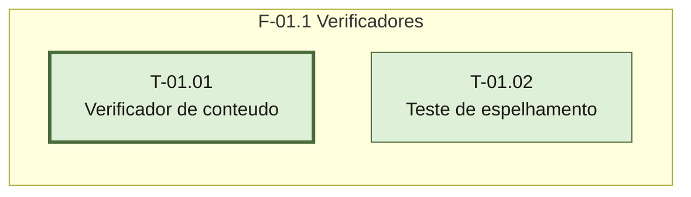

# Fases — Sprint 01

## F-01.1 — Verificadores de conteúdo e de espelhamento

**Objetivo:** criar os dois scripts que tornam testável o que hoje só é revisado a olho.

**Tasks:** T-01.01, T-01.02

**Critério de saída:** `testar-conteudo.sh` e `testar-espelho.sh` existem, são executáveis e
rodam sem travar. `testar-conteudo.sh` reprova no estado atual (o formato condensado ainda
não está documentado); `testar-espelho.sh` passa (as árvores estão idênticas hoje).

**Roda em paralelo com:** nenhuma.
