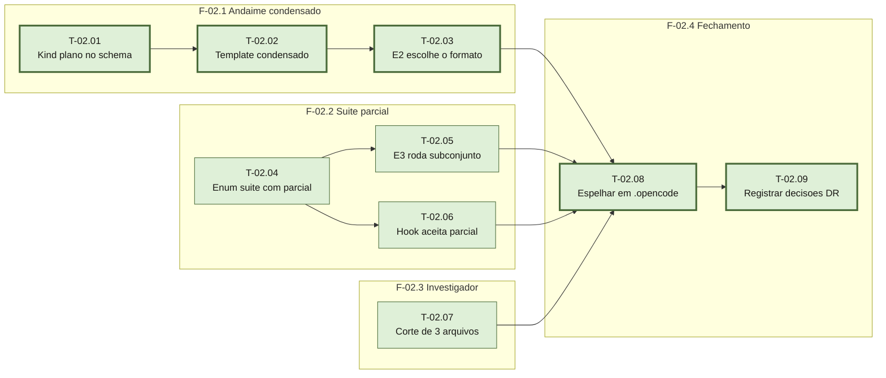

# Fases — Sprint 02

## F-02.1 — Andaime condensado

**Objetivo:** permitir que um plano de 1 sprint e 1 fase seja gravado em um arquivo só.

**Tasks:** T-02.01, T-02.02, T-02.03

**Critério de saída:** as asserções de formato condensado do `testar-conteudo.sh` passam —
o `00-schema.md` declara o kind `plano`, existe `TEMPLATE-plano-condensado.md` sem marcador
vazado, e o `02-plano.md` diz quando usar cada formato.

**Roda em paralelo com:** F-02.2 e F-02.3 (arquivos disjuntos: esta toca `00-schema.md`,
`02-plano.md` e um asset novo; a F-02.2 toca `03-fix.md`, `04-qa.md` e um hook; a F-02.3
toca `01-investigacao.md`).

> Atenção: T-02.01 e T-02.04 tocam ambas o `00-schema.md`. Por isso as duas são
> `paralelizavel: false` dentro das suas fases — ver `tasks.md`. As fases são paralelas;
> essas duas tasks específicas, não.

## F-02.2 — Suíte parcial por task

**Objetivo:** o E3 roda o subconjunto afetado; o E4 exige a execução completa.

**Tasks:** T-02.04, T-02.05, T-02.06

**Critério de saída:** o enum `suite` inclui `parcial`, o `03-fix.md` manda rodar o
subconjunto, o `04-qa.md` exige a completa antes do veredito, e o hook
`task-so-fecha-verde` aceita `parcial` sem barrar — provado por caso novo em `testar.sh`.

**Roda em paralelo com:** F-02.1 e F-02.3.

## F-02.3 — Investigador por evidência

**Objetivo:** delegar ao agente só quando o grep devolver 3 ou mais arquivos.

**Tasks:** T-02.07

**Critério de saída:** o `01-investigacao.md` traz o corte de 3 arquivos, com o que fazer
em cada lado do corte.

**Roda em paralelo com:** F-02.1 e F-02.2.

## F-02.4 — Espelhamento e fechamento

**Objetivo:** espelhar tudo em `.opencode/` e registrar as decisões de projeto.

**Tasks:** T-02.08, T-02.09

**Critério de saída:** `testar-espelho.sh` sai 0, `testar-conteudo.sh` sai 0 e
`testar.sh` sai com 0 falhas.

**Roda em paralelo com:** nenhuma — depende de todas as anteriores.
