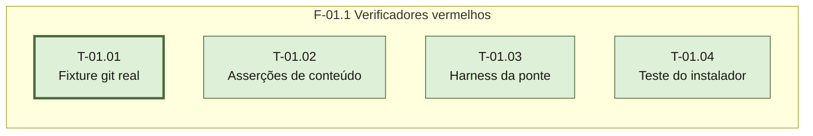

# Fases — Sprint 01

## F-01.1 — Verificadores vermelhos

**Objetivo:** ter, antes de qualquer mudança de conteúdo ou de código, o teste que vai
falhar por cada uma delas.

**Tasks:** T-01.01, T-01.02, T-01.03, T-01.04 — as quatro são `paralelizavel: true` entre si:
cada uma toca um arquivo só, e os quatro arquivos são distintos.

**Critério de saída:** os quatro scripts existem; cada asserção nova falha pelo nome; as
suítes que já passavam (`testar-falsos-positivos.sh`, `testar-espelho.sh`) continuam em 0
falhas; `testar.sh` mantém os 59 casos anteriores ok.

**Roda em paralelo com:** nenhuma — é a única fase da sprint.
