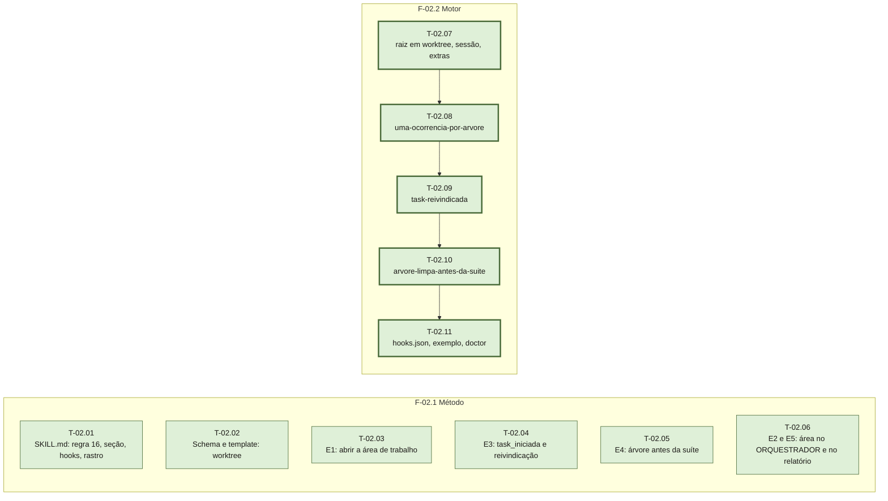

# Fases — Sprint 02

## F-02.1 — Método (markdown da skill)

**Objetivo:** o texto que os três harnesses leem passa a descrever o trabalho em sessões
paralelas: worktree por ocorrência, uma ocorrência por árvore, reivindicação de task,
árvore limpa antes da suíte, identidade no rastro.

**Tasks:** T-02.01 a T-02.06 — todas `paralelizavel: true`: cada uma toca arquivos que
nenhuma outra toca (`SKILL.md` / `00-schema.md`+`TEMPLATE-ocorrencia.md`+`06-estado.md` /
`01-investigacao.md` / `03-fix.md` / `04-qa.md` / `02-plano.md`+`TEMPLATE-ORQUESTRADOR.md`+`05-relatorio.md`).

**Critério de saída:** as 13 asserções de conteúdo sobre a skill (todas de T-01.02 menos
`readme-mimocode`) passam; nenhum `{{...}}` vazado (asserção existente).

**Roda em paralelo com:** F-02.2.

## F-02.2 — Motor (biblioteca e hooks Python)

**Objetivo:** `expx_rastro` reconhece worktree e sessão; três hooks novos; registro e
diagnóstico atualizados.

**Tasks:** T-02.07 → T-02.08 → T-02.09 → T-02.10 → T-02.11, em cadeia: T-02.07 entrega
`sessao()` que os hooks seguintes usam, e todas editam `testar.sh`.

**Critério de saída:** `testar.sh` e `testar-falsos-positivos.sh` em 0 falhas com os casos
novos; `doctor.py` lista nove hooks.

**Roda em paralelo com:** F-02.1.
