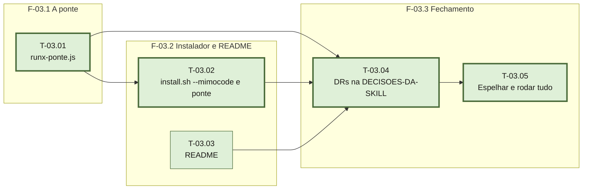

# Fases — Sprint 03

## F-03.1 — A ponte

**Objetivo:** `runx-ponte.js` traduz os eventos do OpenCode e do MimoCode para o despachante.

**Tasks:** T-03.01.

**Critério de saída:** `testar-ponte.sh` sai 0 falhas.

**Roda em paralelo com:** F-03.2 — T-03.03 (README) não depende da ponte; T-03.02 depende
de T-03.01 e por isso é `paralelizavel: false`.

## F-03.2 — Instalador e README

**Objetivo:** o instalador distribui a ponte e os grupos novos; o README documenta os três
harnesses.

**Tasks:** T-03.02 (depende de T-03.01), T-03.03.

**Critério de saída:** `testar-instalador.sh` sai 0 falhas; `readme-mimocode` passa.

**Roda em paralelo com:** F-03.1.

## F-03.3 — Fechamento

**Objetivo:** registrar as decisões, espelhar as árvores, rodar as seis suítes.

**Tasks:** T-03.04 → T-03.05.

**Critério de saída:** as seis suítes em 0 falhas e as árvores idênticas.

**Roda em paralelo com:** nenhuma.
